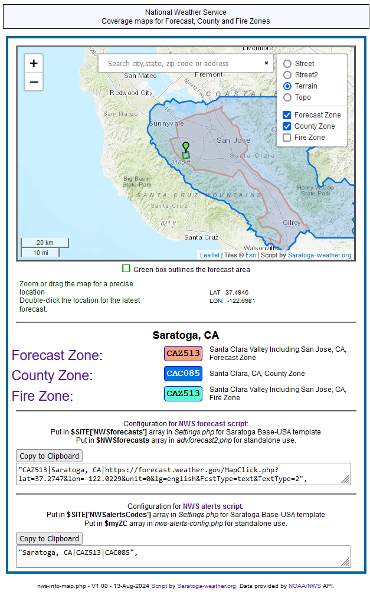

## NWS Zone Information with Leaflet map

This script uses the NWS API at https://api.weather.gov/ for
JSON data regarding the forecast latitude/longitude point and gathers data regarding the Forecast, County and Fire Zones and displays them on a Leaflet map.
It also produces easy copycode to configure the NWS Forecast Script and NWS Alerts Script

**Note:** Only points in the United States and territories will display maps.
The search function on the map can use city state, Zip code, and sometimes address to search.
otherwise, position the map and double-click on a location to load the data.

Using Leaflet/OpenStreetMap means no API key is required for display of the map. However, if you wish to use the OPTIONAL Mapbox.com tiles (terrain3, Satellite maps), you will need a Mapbox.com API key (called an "Access Token") which can be acquired (for free with 50K accesses usage/month) at:

https://www.mapbox.com/signup/?

in the _NWS-info-map.php_ script you can put

$setMapboxAPIkey = '-replace-this-with-your-API-key-here-';

Note: if using the Saratoga template set, put a new entry in _Settings.php_

$SITE['mapboxAPIkey'] = '-replace-this-with-your-API-key-here-';

A Mapbox API key is OPTIONAL .. you do not need it to use maps from included free map tile providers.

## Script operation

The script will make two to five API calls to api.weather.gov when a location is loaded 
(either at script initialization, a search, or a double-click on a point on the displayed map).

Changing the basemap or overlay tiles, zoom-in/zoom-out or scrolling the map does not result in API calls to api.weather.gov

The first API request is for **/points/&lt;latitude>,&lt;longitude>** 
and the resulting JSON has the metadata for Forecast, County and Fire Zones and the gridpoint info for the forecast area.

The second API request is for **/gridpoints/&lt;WFO>/&lt;gridpointX>,&lt;gridpointY>** 
which contains forecast grid coordinates associated with that point (drawn in green box on map).

The next 3 API calls (if not already cached) are to **/zones/forecast/&lt;ForecastZone>**,
**/zones/county/&lt;CountyZone>**,
**/zones/fire/&lt;FireZone>**
to retrieve the respective coordinates to plot on the map.
  
These three accesses have the JSON data stored in **./cache/** for 1 day 
to minimize the successive requests for nearby locations that have the same zones.

Be aware that sometimes API calls are not successful. The cache files
will be stored only on successful requests.  If you receive one or more
failure indications, just wait a bit and reload the page in the browser.

## Script settings

The following are customizable settings for the _NWS-info-map.php_ script:

```php
# settings: --------------------------------------------------------------------
# if you are using www.mapbox.com for map tiles, you
# need to acquire an API ke from that service
#
#  put this in the CALLING page for quake-json.php script:
/*
  $mapboxAPIkey = '-replace-this-with-your-API-key-here-';
*/
# Note: if using the Saratoga template set, put a new entry in Settings.php
/*

$SITE['mapboxAPIkey'] = '-replace-this-with-your-API-key-here-';

*/
# and you won't need to change the $mapAPI value above (nor any of the other
# settings in the script below.
#
#  change myLat, myLong to your station latitude/longitude,
#  set $ourTZ to your time zone
#    other settings are optional
#
#  set to station latitude/longitude (decimal degrees)
  $myLat = 37.2747;    //North=positive, South=negative decimal degrees
  $myLong = -122.0229;   //East=positive, West=negative decimal degrees
# The above settings are for saratoga-weather.org location
  $ourTZ = "America/Los_Angeles";  //NOTE: this *MUST* be set correctly to
# translate UTC times to your LOCAL time for the displays.
# Use https://www.php.net/manual/en/timezones.php to find the timezone suitable for
#  your location.
#
#  pick a format for the time to display ..uncomment one (or make your own)
# $timeFormat = 'D, Y-m-d H:i:s T';  // Fri, 2006-03-31 14:03:22 TZone
#  $timeFormat = 'D, d-M-Y g:i:s a T';  // Fri, 31-Mar-2006 4:03:22 am TZone
  $timeFormat = 'g:i a T M d, Y';  // 10:30 am CDT March 31, 2018

	# see: http://leaflet-extras.github.io/leaflet-providers/preview/ for additional maps
	# select ONE map tile provider by uncommenting the values below.

	$mapProvider = 'Esri_WorldTopoMap'; // ESRI topo map - no key needed
	#$mapProvider = 'OSM';     // OpenStreetMap - no key needed
	#$mapProvider = 'Terrain'; // Terrain map by stamen.com - no key needed
	#$mapProvider = 'OpenTopo'; // OpenTopoMap.com - no key needed
	#$mapProvider = 'Wikimedia'; // Wikimedia map - no key needed
#
	#$mapProvider = 'MapboxSat';  // Maps by Mapbox.com - API KEY needed in $mapboxAPIkey
	#$mapProvider = 'MapboxTer';  // Maps by Mapbox.com - API KEY needed in $mapboxAPIkey
	$mapboxAPIkey = '--mapbox-API-key--';
	# use this for the API key to MapBox
  $mapZoomDefault = 11;  // =11; default Leaflet Map zoom entry for display (1=world, 14=street)

# end of settings -------------------------------------------------------------

```

If you are running the script in a Saratoga template, then the following entries in _Settings.php_ will
override what is defaulted in the _NWS-info-map.php_ script:

```php
$SITE['latitude']
$SITE['longitude']
$SITE['tz']
$SITE['timeFormat']
$SITE['mapboxAPIkey']
```

## Using in your existing page design

Put the following before the &lt;/head> part of your page:

```php
<link rel="stylesheet" href="NWS-info-map.css" />
<style type="text/css">
<!--
.graytitles {
  font-size:large;
  text-align:center;
  margin-top: 5px;
}
-->
</style>
</head>
```
and put the following in the main display section of your page:

```php
<?php
  $doInclude = true;
	include_once('NWS-info-map.php');

?>
```
## Sample Output



